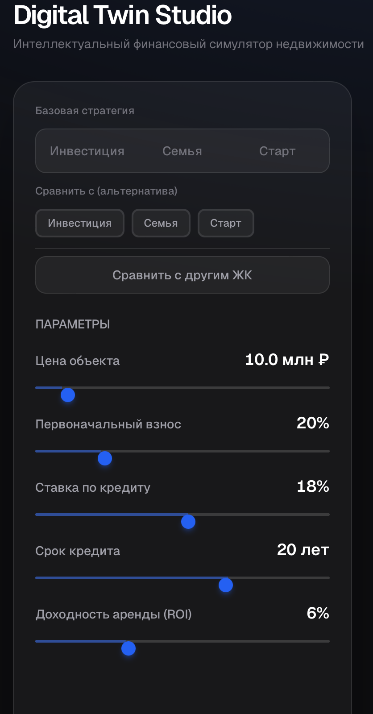
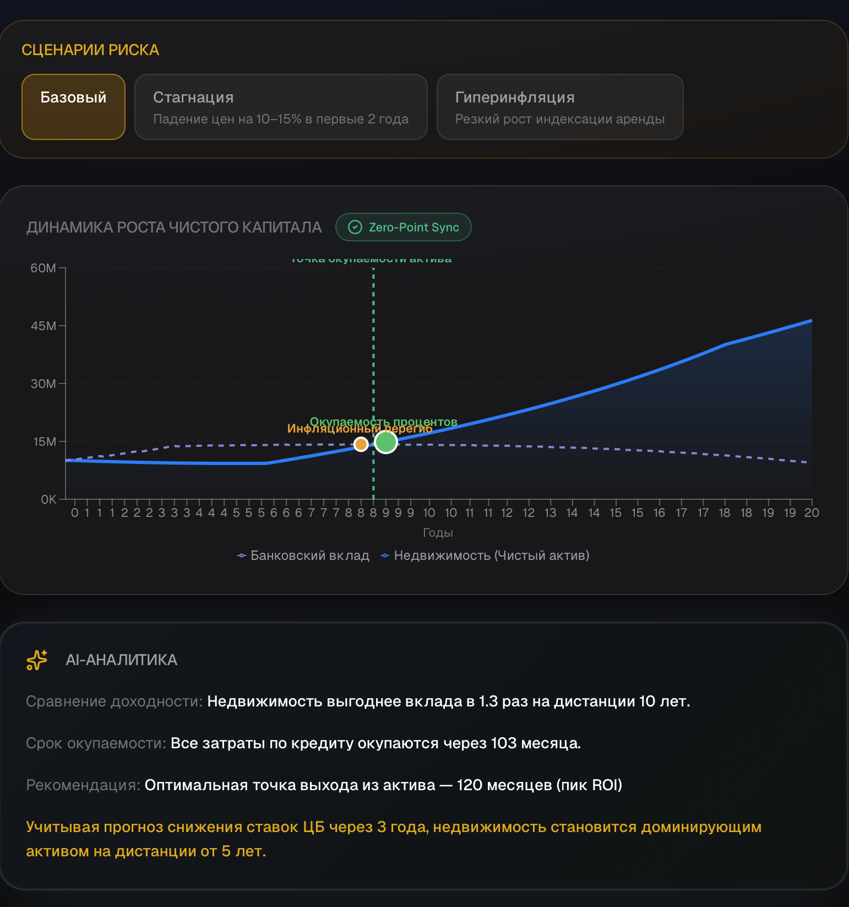
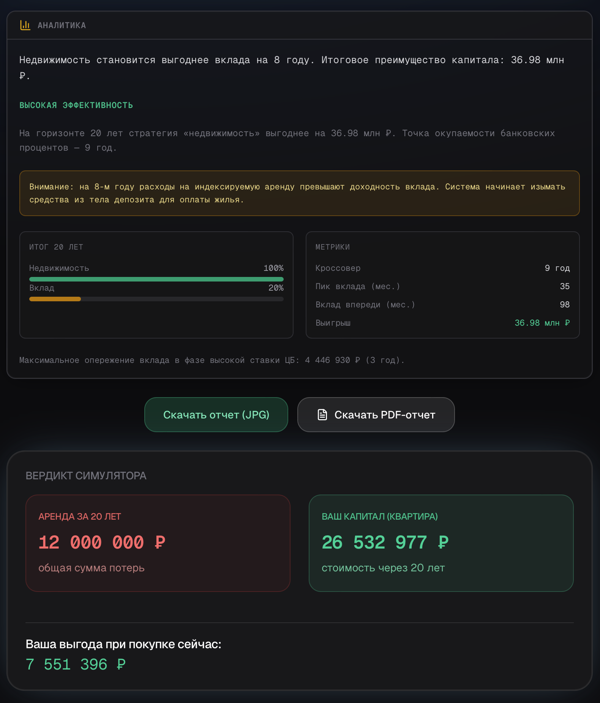
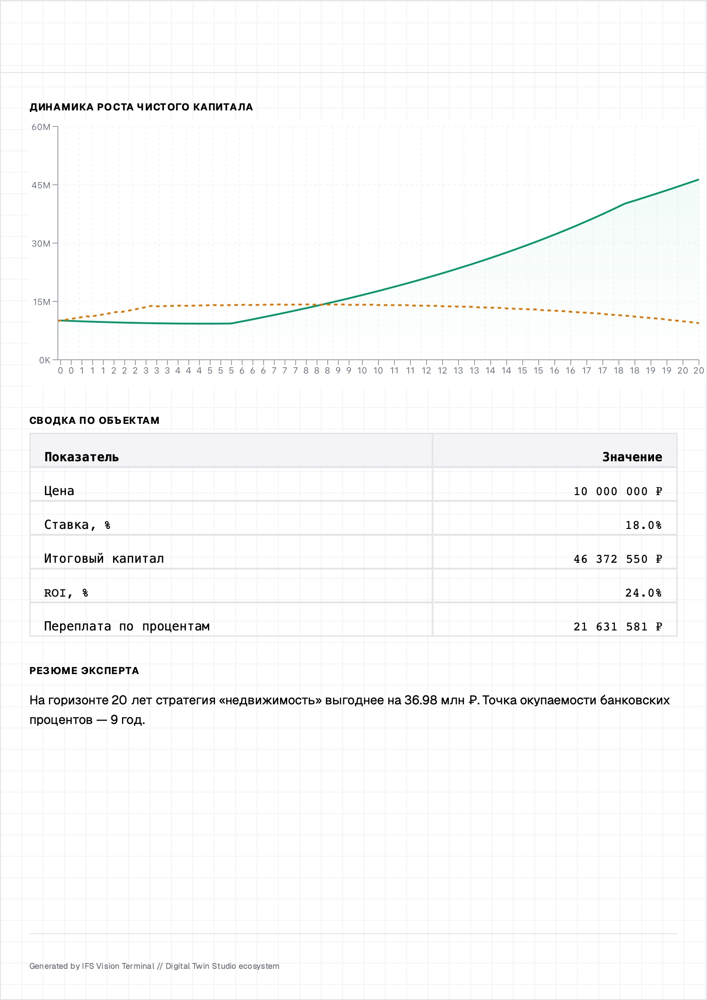

# IFS Vision // High-Precision Capital Efficiency Terminal
> Part of the **Digital Twin Studio** ecosystem.
**Author:** [mikolaysemyonov-code](https://github.com/mikolaysemyonov-code) · Digital Twin Studio  
**v3.9.5** · [Live Demo](https://ifs-vision-final.vercel.app)
## The Philosophy: Digital Reincarnation
IFS Vision противостоит **архитектурной энтропии** в личных финансах: 
размытым сравнениям, неочевидным допущениям и «удобным» цифрам. Инструмент 
даёт **деконструкцию депозитной ловушки** — ситуации, когда высокие ставки 
по вкладам создают иллюзию выгодности кэша и отталкивают от использования 
кредитного плеча и роста актива. Единая точка входа капитала, 
индексированная аренда и явная модель ставок ЦБ превращают выбор «банк vs 
недвижимость» в прозрачное, воспроизводимое сравнение.
## Engineering Excellence

### Financial Integrity Engine
- **Чистая математика** — аннуитет, налоговые вычеты, ROI и сравнение с 
арендой вынесены в отдельный слой чистых функций; все коэффициенты заданы 
константами.
- **Налогово-инфляционный фильтр** — коэффициент **0.85** к доходности 
вклада после 36-го месяца (имитация налога на доход и инфляции) для 
реалистичной картины на горизонте 20 лет.
- **Динамические ставки ЦБ** — фаза высокой ставки (например 18%) в первые 
36 месяцев, затем переход к целевой 8%; вклад и недвижимость сравниваются 
в одной и той же макро-модели.

### Zero-Point Sync

Технология **честного сравнения капитала** из единой точки входа: и линия 
«Недвижимость», и линия «Вклад» стартуют с одной и той же суммы (например 
10 млн ₽). Остаток кэша после первоначального взноса участвует в общем 
капитале сценария недвижимости и постепенно уменьшается по мере выплат по 
ипотеке. Преимущество на графике и в тултипе — строго разница между этими 
двумя синхронизированными линиями.

### Performance

- **Next.js 15**, App Router, TypeScript.
- **Zustand** с селекторами — минимизация ре-рендеров; тяжёлые расчёты в 
едином хуке и сервисном слое.
- **60 FPS UX** — обновление графика через `requestAnimationFrame`; 
анимации (Framer Motion) не привязаны к пересчёту данных.
## B2B & SaaS Capabilities
| Capability | Description |
|------------|-------------|
| **White Label** | Динамический брендинг: логотип, название компании, 
контактный телефон, цвет. Настраивается в админ-панели и через 
URL-параметры для экспорт-режима. |
| **Telegram Lead-Gen** | Захват контактов (имя, телефон) через модальное 
окно с мгновенной отправкой лида в Telegram (опционально, при заданных 
`BOT_TOKEN` и `CHAT_ID`). |
| **PDF / JPG Report Engine** | Генерация визуальных инвест-отчётов (JPG) 
через внешний Screenshot API; ключ задаётся в `SCREENSHOT_API_KEY`. |
## Tech Stack & Setup
**Stack:** Next.js 15 · React 19 · TypeScript · Tailwind CSS · Framer 
Motion · Recharts · Zustand · Vercel.

1. Клонировать репозиторий и установить зависимости:
   git clone https://github.com/your-org/ifs-vision.git
   cd ifs-vision
   ```
2. Настроить окружение (все секреты — только из `process.env`):
   ```bash
   cp .env.example .env
   ```
   В `.env` задать: `NEXT_PUBLIC_SITE_URL`, `SCREENSHOT_API_KEY`, 
   `ADMIN_PASSWORD`; при необходимости — `BOT_TOKEN`, `CHAT_ID`.
3. Запуск в режиме разработки и продакшен-сборка:
   ```bash
   npm run dev
   npm run build && npm start
   ```

**Industrial Grade Financial Engine. Part of the Digital Twin Studio ecosystem.**  
*v3.9.5 Diamond Release · Developed by [mikolaysemyonov-code](https://github.com/mikolaysemyonov-code)*

---

## 🎯 О проекте
**IFS Vision** — это инвестиционный терминал высокой точности для деконструкции «депозитной ловушки». В отличие от обычных калькуляторов, система наглядно доказывает через математическое моделирование, почему стратегия накопления в кэше на горизонте 10+ лет ведет к потере капитала из-за инфляционных ножниц и индексации аренды.

---

## 🎥 Visual Overview

### 1. Terminal Interface & Strategy Selection

*Интерфейс выбора базовой стратегии и параметров ипотечного плеча.*

### 2. Zero-Point Sync & Inflation Inflection

*Динамика чистого капитала. Визуализация точки «Инфляционного перегиба» на 8-м году.*

### 3. AI-Insights & Institutional Analytics

*Глубокая декомпозиция: ROI, пики доходности вклада и экспертные вердикты системы.*

### 4. Investor Deck & B2B Report Generation

*Генерация премиальных JPG-отчетов с White Label поддержкой и аналитикой.*

---

## 🚀 Key Features

*   **Zero-Point Sync Logic:** Авторская технология синхронизации стартового капитала. Сравнение идет из единой точки входа (Equity).
*   **Inflation Inflection Point:** Автоматический поиск точки, где расходы на аренду превышают доходность вклада.
*   **Safe Money Engine:** Целочисленные вычисления (в копейках) для 100% точности без погрешностей `floating point`.
*   **B2B White Label:** Динамический брендинг через URL-параметры (`?partner=name`).
*   **Investor Deck Generator:** Рендеринг инвест-меморандумов в JPG на стороне клиента.
*   **Multi-Property Battle:** Одновременное сравнение двух объектов недвижимости против вклада.

---

## 🛠 Tech Stack (Bleeding Edge)

*   **Framework:** Next.js 16.1 (Turbopack)
*   **Runtime:** React 19 + **React Compiler**
*   **State:** Zustand + `useShallow` selectors (60 FPS UX)
*   **Charts:** Recharts (High-performance analytical layers)
*   **Styles:** Tailwind CSS (Bloomberg/Apple style UI)

---

## 📦 Installation & Setup

1. **Clone & Install:**
   ```bash
   git clone https://github.com/ifs-vision-final.git
   cd ifs-vision-final
   npm install


*Используйте код с осторожностью.*

**Run:**

```bash
npm run build
npm run start
```
