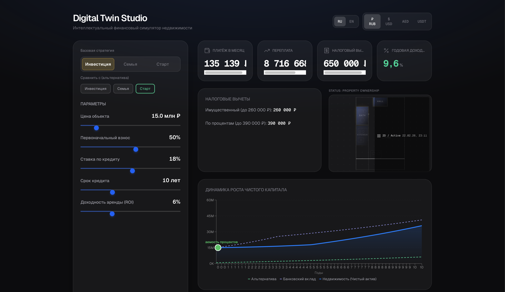
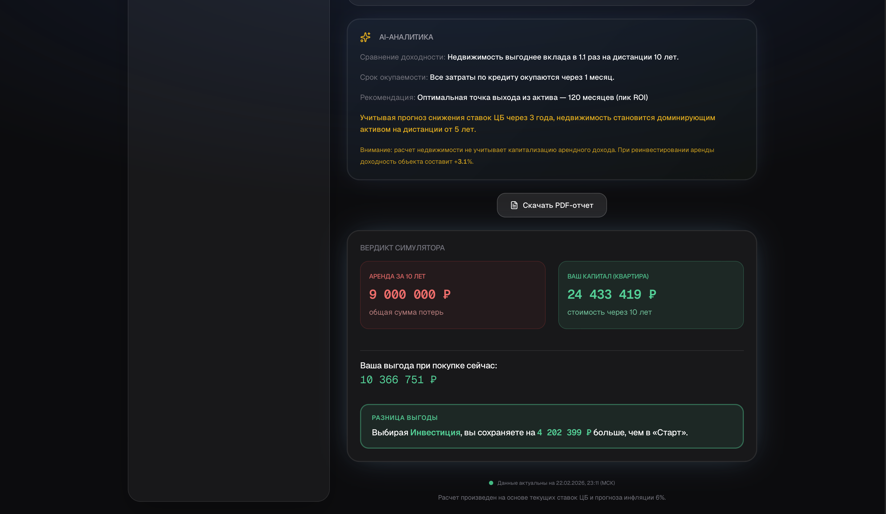
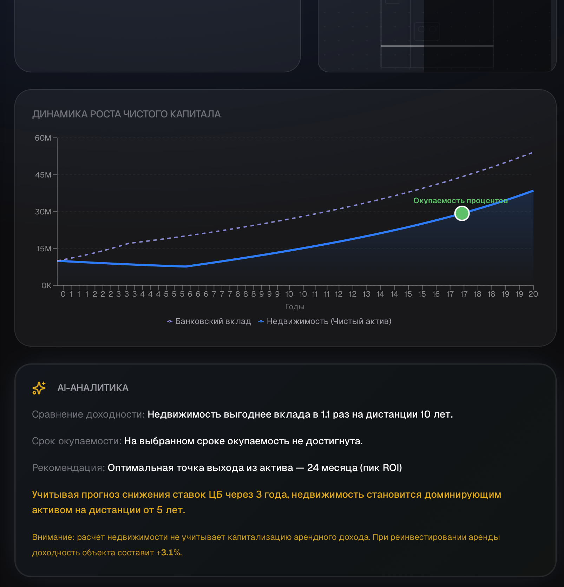

# IFS Vision // High-Precision Capital Efficiency Terminal

> Part of the **Digital Twin Studio** ecosystem.

**v2.6 Diamond Release** · [Live Demo](https://ifs-vision.vercel.app)

---

## Visual Overview

<p align="center">
  
</p>
<p align="center"><em>Terminal Hero Interface — главный экран с графиком</em></p>

<p align="center">
  
</p>
<p align="center"><em>Zero-Point Sync — честное сравнение капитала из единой точки входа</em></p>

<p align="center">
  
</p>
<p align="center"><em>Адаптивность и PDF-отчёты</em></p>

---

## The Philosophy: Digital Reincarnation

IFS Vision противостоит **архитектурной энтропии** в личных финансах: размытым сравнениям, неочевидным допущениям и «удобным» цифрам. Инструмент даёт **деконструкцию депозитной ловушки** — ситуации, когда высокие ставки по вкладам создают иллюзию выгодности кэша и отталкивают от использования кредитного плеча и роста актива. Единая точка входа капитала, индексированная аренда и явная модель ставок ЦБ превращают выбор «банк vs недвижимость» в прозрачное, воспроизводимое сравнение.

---

## Engineering Excellence

### Financial Integrity Engine

- **Чистая математика** — аннуитет, налоговые вычеты, ROI и сравнение с арендой вынесены в отдельный слой чистых функций; все коэффициенты заданы константами.
- **Налогово-инфляционный фильтр** — коэффициент **0.85** к доходности вклада после 36-го месяца (имитация налога на доход и инфляции) для реалистичной картины на горизонте 20 лет.
- **Динамические ставки ЦБ** — фаза высокой ставки (например 18%) в первые 36 месяцев, затем переход к целевой 8%; вклад и недвижимость сравниваются в одной и той же макро-модели.

### Zero-Point Sync

Технология **честного сравнения капитала** из единой точки входа: и линия «Недвижимость», и линия «Вклад» стартуют с одной и той же суммы (например 10 млн ₽). Остаток кэша после первоначального взноса участвует в общем капитале сценария недвижимости и постепенно уменьшается по мере выплат по ипотеке. Преимущество на графике и в тултипе — строго разница между этими двумя синхронизированными линиями.

### Performance

- **Next.js 15**, App Router, TypeScript.
- **Zustand** с селекторами — минимизация ре-рендеров; тяжёлые расчёты в едином хуке и сервисном слое.
- **60 FPS UX** — обновление графика через `requestAnimationFrame`; анимации (Framer Motion) не привязаны к пересчёту данных.

---

## B2B & SaaS Capabilities

| Capability | Description |
|------------|-------------|
| **White Label** | Динамический брендинг: логотип, название компании, контактный телефон, цвет. Настраивается в админ-панели и через URL-параметры для экспорт-режима. |
| **Telegram Lead-Gen** | Захват контактов (имя, телефон) через модальное окно с мгновенной отправкой лида в Telegram (опционально, при заданных `BOT_TOKEN` и `CHAT_ID`). |
| **PDF / JPG Report Engine** | Генерация визуальных инвест-отчётов (JPG) через внешний Screenshot API; ключ задаётся в `SCREENSHOT_API_KEY`. |

---

## Tech Stack & Setup

**Stack:** Next.js 15 · React 19 · TypeScript · Tailwind CSS · Framer Motion · Recharts · Zustand · Vercel.

1. Клонировать репозиторий и установить зависимости:
   ```bash
   git clone https://github.com/your-org/ifs-vision.git
   cd ifs-vision
   npm install
   ```

2. Настроить окружение (все секреты — только из `process.env`):
   ```bash
   cp .env.example .env
   ```
   В `.env` задать: `NEXT_PUBLIC_SITE_URL`, `SCREENSHOT_API_KEY`, `ADMIN_PASSWORD`; при необходимости — `BOT_TOKEN`, `CHAT_ID`.

3. Запуск в режиме разработки и продакшен-сборка:
   ```bash
   npm run dev
   npm run build && npm start
   ```

---

## License

**MIT**
